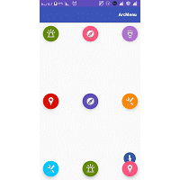
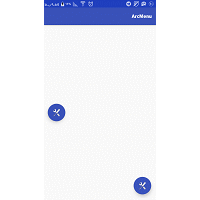

[](http://www.apache.org/licenses/LICENSE-2.0.html)
[](http://search.maven.org/#search%7Cga%7C1%7Ca%3A%22android-maven-gradle-plugin%22)
[](https://jitpack.io/#BrotherV/Floating-ArcMenu)
# Floating-ArcMenu
**A prety menu for all application**

Android floating arc menu which reacts on scrolling events. Becomes visible when an attached target is scrolled up and invisible when scrolled down.




**1)** Add the ``com.bvapp.arcmenulibrary.ArcMenu`` to your layout XML file. You can put the menu in everywhere you want.
The width and height of the floating arc menu are hardcoded to **64dp** for the large, **56dp** for the normal and **42dp**
for the mini menu button.

```xml
<FrameLayout xmlns:android="http://schemas.android.com/apk/res/android"
             xmlns:arc="http://schemas.android.com/apk/res-auto"
             android:layout_width="match_parent"
             android:layout_height="match_parent">

    <android.support.v7.widget.RecyclerView
        android:id="@+id/recycler_view"
        android:layout_width="match_parent"
        android:layout_height="match_parent"
        android:cacheColorHint="@android:color/transparent"
        android:scrollbars="vertical"/>

    <com.bvapp.arcmenulibrary.ArcMenu
        android:id="@+id/arcMenu"
        android:layout_width="wrap_content"
        android:layout_height="wrap_content"
        arc:menuType="normal"
        arc:menuChildSize="48dp"
        arc:menuGravity="Right_Middle"
        arc:menuClickAnim="true"
        arc:menuChildAnim="false"
        arc:menuShadowElevation="true"
        arc:menuNormalColor="@color/colorAccent"
        arc:menuImage="@mipmap/tools"
        android:layout_gravity="center_horizontal|right"
        android:layout_marginRight="6dp"
        android:layout_marginBottom="6dp"
        >
    </com.bvapp.arcmenulibrary.ArcMenu>
</FrameLayout>
```
**2)** Add java code in activity or fragment
``` java
private static final int[] ITEM_DRAWABLES = { R.mipmap.facebook,
			R.mipmap.twitter, R.mipmap.flickr, R.mipmap.instagram,
			R.mipmap.skype, R.mipmap.github };

private static final String[] STR = {"Facebook","Twiiter","Flickr","Instagram","Skype","Github"};

//
//

RecyclerView recyclerView = (RecyclerView) findViewById(R.id.recycler_view);
RecyclerViewAdapter adapter = new RecyclerViewAdapter(new MyMisic());
recyclerView.setAdapter(adapter);

ArcMenu menu = (ArcMenu) findViewById(R.id.arcMenu);
menu.attachToRecyclerView(recyclerView);
menu.showTooltip(true);
menu.setToolTipBackColor(Color.WHITE);
menu.setToolTipCorner(6f);
menu.setToolTipPadding(2f);
menu.setToolTipTextColor(Color.BLUE);
menu.setAnim(300,300,ArcMenu.ANIM_MIDDLE_TO_RIGHT,ArcMenu.ANIM_MIDDLE_TO_RIGHT,
      ArcMenu.ANIM_INTERPOLATOR_ACCELERATE_DECLERATE,ArcMenu.ANIM_INTERPOLATOR_ACCELERATE_DECLERATE);

final int itemCount = ITEM_DRAWABLES.length;
for (int i = 0; i < itemCount; i++) {
	ImageView item = new ImageView(this);
	item.setImageResource(MenuItem.ITEM_DRAWABLES[i]);
 	final int position = i;
	menu.addItem(item, STR[i], new View.OnClickListener() {
			@Override
			public void onClick(View v) {
        //You can access child click in here
			}
	});
}
```

New Features
====================

In new version you can add add internarl FloatingActionButton as child for this menu, een user can add fab icon, set size of fab icon programmatically. this sample has shown how to use different method and fab button for Floating-ArcMenu.
``` java
private static final int[] ITEM_DRAWABLES = { R.mipmap.facebook_w, R.mipmap.flickr_w, R.mipmap.instagram_w,
			R.mipmap.github_w };
private String[] str = {"Facebook","Flickr","Instagram","Github"};

//
//

ArcMenu arcMenu = (ArcMenu) findViewById(R.id.arcMenuX);
ArcMenu arcMenuY = (ArcMenu) findViewById(R.id.arcMenuY);

arcMenu.setToolTipTextSize(14);  // This method will set tooltip text size
arcMenu.setMinRadius(104);  //This method will change child radius programmatically
arcMenu.setArc(175,255);  //This method will change arc of menu
arcMenu.setToolTipSide(ArcMenu.TOOLTIP_LEFT); //This method will override tooltip direction
arcMenu.setToolTipTextColor(Color.WHITE); //This method will set tooltip text color
arcMenu.setToolTipBackColor(Color.parseColor("#88000000"));  //This method will set tooltip background
arcMenu.setToolTipCorner(2);  //set tooltip corner
arcMenu.setToolTipPadding(8);  //set tooltip padding
arcMenu.setColorNormal(getResources().getColor(R.color.colorPrimary));  //set menu button normal color programmatically
arcMenu.setColorPressed(getResources().getColor(R.color.colorPrimaryDark));  //set menu button press color programmatically
arcMenu.setColorRipple(getResources().getColor(R.color.colorAccent));  //set menu button ripple color programmatically for api>21
arcMenu.showTooltip(true); //show tooltip
arcMenu.setAnim(500,500,ArcMenu.ANIM_MIDDLE_TO_DOWN,ArcMenu.ANIM_MIDDLE_TO_RIGHT,
		ArcMenu.ANIM_INTERPOLATOR_ANTICIPATE,ArcMenu.ANIM_INTERPOLATOR_ANTICIPATE);

initArcMenu(arcMenu, str, ITEM_DRAWABLES, ITEM_DRAWABLES.length - 1);
//
//
private void initArcMenu(final ArcMenu menu, final String[] str, int[] itemDrawables, int count) {
	for (int i = 0; i < count; i++) {
		FloatingActionButton item = new FloatingActionButton(this);  //Use internal fab as a child
		item.setFabSize(FloatingActionButton.SIZE_MINI);  //set minimum size for fab 42dp
		item.setShadow(true); //enable to draw shadow
		item.setTopIcon(itemDrawables[i]); //add icon for fab
		item.setIconSize(0.75f);  //this method will resize icon of fab (1f>icon size>0.4f)
		item.setColorNormal(getResources().getColor(R.color.colorPrimary));  //set menu button normal color programmatically
		item.setColorPressed(getResources().getColor(R.color.colorPrimaryDark));  //set menu button press color programmatically
		item.setColorRipple(getResources().getColor(R.color.colorAccent));  //set menu button ripple color programmatically
	
		final int position = i;
		menu.addItem(item, str[i], new View.OnClickListener() {
			@Override
			public void onClick(View v) {
				Toast.makeText(ActivityTooltip.this, str[position],
						Toast.LENGTH_SHORT).show();
			}
		});
	}
}

```


Usage
====================

Step 1. Add it in your root build.gradle at the end of repositories:
```Groovy
allprojects {
		repositories {
			...
			maven { url 'https://jitpack.io' }
		}
	}
```
Step 2. Add the dependency
```Groovy
dependencies {
	        compile 'com.github.BrotherV:Floating-ArcMenu:1.0.7'
	}
```
# Credits
I used [ArcMenu by Capricorn](https://github.com/daCapricorn/ArcMenu) and [FloatingActionButton](https://github.com/makovkastar/FloatingActionButton) 
libraries as a base for development.

# License
```
Copyright 2017 BrotherV

Licensed under the Apache License, Version 2.0 (the "License");
you may not use this file except in compliance with the License.
You may obtain a copy of the License at

   http://www.apache.org/licenses/LICENSE-2.0

Unless required by applicable law or agreed to in writing, software
distributed under the License is distributed on an "AS IS" BASIS,
WITHOUT WARRANTIES OR CONDITIONS OF ANY KIND, either express or implied.
See the License for the specific language governing permissions and
limitations under the License.
```


