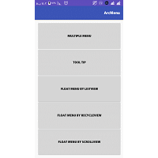
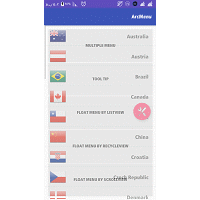
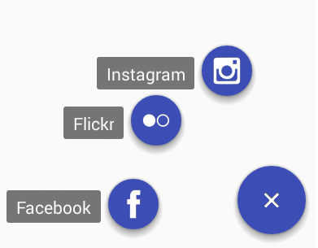
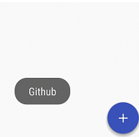

[](http://www.apache.org/licenses/LICENSE-2.0.html)
[](http://search.maven.org/#search%7Cga%7C1%7Ca%3A%22android-maven-gradle-plugin%22)
[](https://jitpack.io/#BrotherV/Floating-ArcMenu)
# Floating-ArcMenu
**A prety menu for all applications**

Android floating arc menu which reacts on scrolling events. Becomes visible when an attached target is scrolled up and invisible when scrolled down.






**1)** Add the ``com.bvapp.arcmenulibrary.ArcMenu`` to your layout XML file. You can put the menu in everywhere you want.
The width and height of the floating arc menu are hardcoded to **64dp** for the large, **56dp** for the normal and **42dp**
for the mini menu button.

```xml
<FrameLayout xmlns:android="http://schemas.android.com/apk/res/android"
             xmlns:arc="http://schemas.android.com/apk/res-auto"
             android:layout_width="match_parent"
             android:layout_height="match_parent">

    <android.support.v7.widget.RecyclerView
        android:id="@+id/recycler_view"
        android:layout_width="match_parent"
        android:layout_height="match_parent"
        android:cacheColorHint="@android:color/transparent"
        android:scrollbars="vertical"/>

    <com.bvapp.arcmenulibrary.ArcMenu
        android:id="@+id/arcMenu"
        android:layout_width="wrap_content"
        android:layout_height="wrap_content"
        arc:menuType="normal"
        arc:menuChildSize="48dp"
        arc:menuGravity="Right_Middle"
        arc:menuClickAnim="true"
        arc:menuChildAnim="false"
        arc:menuShadowElevation="true"
        arc:menuNormalColor="@color/colorAccent"
        arc:menuImage="@mipmap/tools"
        android:layout_gravity="center_horizontal|right"
        >
    </com.bvapp.arcmenulibrary.ArcMenu>
</FrameLayout>
```
**2)** Add java code in activity or fragment
``` java
private static final int[] ITEM_DRAWABLES = { R.mipmap.facebook,
			R.mipmap.twitter, R.mipmap.flickr, R.mipmap.instagram,
			R.mipmap.skype, R.mipmap.github };

private static final String[] STR = {"Facebook","Twiiter","Flickr","Instagram","Skype","Github"};

//
//

RecyclerView recyclerView = (RecyclerView) findViewById(R.id.recycler_view);
RecyclerViewAdapter adapter = new RecyclerViewAdapter(new MyMisic());
recyclerView.setAdapter(adapter);

ArcMenu menu = (ArcMenu) findViewById(R.id.arcMenu);
menu.attachToRecyclerView(recyclerView);
menu.showTooltip(true);
menu.setToolTipBackColor(Color.WHITE);
menu.setToolTipCorner(6f);
menu.setToolTipPadding(2f);
menu.setToolTipTextColor(Color.BLUE);
menu.setAnim(300,300,ArcMenu.ANIM_MIDDLE_TO_RIGHT,ArcMenu.ANIM_MIDDLE_TO_RIGHT,
      ArcMenu.ANIM_INTERPOLATOR_ACCELERATE_DECLERATE,ArcMenu.ANIM_INTERPOLATOR_ACCELERATE_DECLERATE);

final int itemCount = ITEM_DRAWABLES.length;
for (int i = 0; i < itemCount; i++) {
	FloatingActionButton item = new FloatingActionButton(this);  // Use internal FAB as child
	// ********* import com.bvapp.arcmenulibrary.widget.FloatingActionButton; *********
	
	item.setSize(FloatingActionButton.SIZE_MINI); // set initial size for child, it will create fab first
	item.setIcon(itemDrawables[i]); // It will set fab icon from your resources which related to 'ITEM_DRAWABLES'
	item.setBackgroundColor(getResources().getColor(R.color.colorPrimary)); // it will set fab child's color
	menu.setChildSize(item.getIntrinsicHeight()); // set absolout child size for menu

	final int position = i;
	menu.addItem(item, str[i], new View.OnClickListener() {
		@Override
		public void onClick(View v) {
		//You can access child click in here			
		}
	});
}
```
### New Features in v1.0.9.3
In this version user will able to add or delet or replace munu child or user can removeAllchild from the menu and initialize it again, also user will able to access OnClickListener and user can change menu icon programmatically. even user will able to add 2 Drawable icons, one for close form and one for open and menu automatically change the icons by order.

``` java
arcMenu.removeAllChild(); // This method will remove all the children
arcMenu.removeChildAt(int index); // This method will remove an specific child
arcMenu.addChildAt(View view, String str, int index, OnClickListener listener); // This method can add a new child at the end 
arcMenu.replaceChildAt(View view, String str, int index, OnClickListener listener); // With this method you will able to replace a child
arcMenu.hasChid(); //It will return true if menu has child.
arcMenu.setIcon(R.mipmap.facebook_w, R.mipmap.github_w); // by adding drawable file ,menu will able to change icons by order.
arcMenu.setDefaultIcon(); // This method will disable up line and will set plus marker on the menu.
```
New plus marker added to menu, if user doesn't want to set icon for menu it will add plus marker automatically for menu.




### New methods:

``` java

ArcMenu arcMenu = (ArcMenu) findViewById(R.id.arcMenuX);
arcMenu.setToolTipTextSize(14);  // This method will set tooltip text size
arcMenu.setMinRadius(104);  //This method will change child radius programmatically
arcMenu.setArc(175,255);  //This method will change arc of menu
arcMenu.setToolTipSide(ArcMenu.TOOLTIP_LEFT); //This method will override tooltip direction
arcMenu.setToolTipTextColor(Color.WHITE); //This method will set tooltip text color
arcMenu.setToolTipBackColor(Color.parseColor("#88000000"));  //This method will set tooltip background color
arcMenu.setToolTipCorner(2);  //set tooltip corner
arcMenu.setToolTipPadding(8);  //set tooltip padding
arcMenu.setColorNormal(getResources().getColor(R.color.colorPrimary));  //set menu button normal color programmatically
arcMenu.showTooltip(true); // This method will enable tooltip to show
arcMenu.isOpen(); // This method will return menu status, if it's open then it will return true.
arcMenu.isClose(); // This method will return menu status, if it's close then it will return true.
arcMenu.performClick(); // This method will return menu status and you can open or close menu programmatically.
arcMenu.setDuration(600); // This method will change time of animation

```
In this version new fab added as internarl FloatingActionButton and you can add it as children for this menu, also user can add fab icon programmatically. this sample has shown how to use different method and fab button for Floating-ArcMenu.
``` java
private static final int[] ITEM_DRAWABLES = { R.mipmap.facebook_w, R.mipmap.flickr_w, R.mipmap.instagram_w };
private String[] str = {"Facebook","Flickr","Instagram"};

//
//

ArcMenu arcMenu = (ArcMenu) findViewById(R.id.arcMenuX);
ArcMenu arcMenuY = (ArcMenu) findViewById(R.id.arcMenuY);

arcMenu.setToolTipTextSize(14);
arcMenu.setMinRadius(104);
arcMenu.setArc(175,255);
arcMenu.setToolTipSide(ArcMenu.TOOLTIP_LEFT);
arcMenu.setToolTipTextColor(Color.WHITE);
arcMenu.setToolTipBackColor(Color.parseColor("#88000000"));
arcMenu.setToolTipCorner(2);  //set tooltip corner
arcMenu.setToolTipPadding(8);  //set tooltip padding
arcMenu.setColorNormal(getResources().getColor(R.color.colorPrimary));
arcMenu.showTooltip(true);
arcMenu.setDuration(600);

initArcMenu(arcMenu, str, ITEM_DRAWABLES);
//
//
private void initArcMenu(final ArcMenu menu, final String[] str, int[] itemDrawables) {
	for (int i = 0; i < itemDrawables.length ; i++) {
		FloatingActionButton item = new FloatingActionButton(this);  //Use internal fab as a child
		item.setSize(FloatingActionButton.SIZE_MINI);  //set minimum size for fab 42dp
		item.setShadow(true); //enable to draw shadow
		item.setIcon(itemDrawables[i]); //add icon for fab
		item.setBackgroundColor(getResources().getColor(R.color.colorPrimary));  //set menu button normal color programmatically
	        menu.setChildSize(item.getIntrinsicHeight()); // fit menu child size exactly same as fab 
		
		final int position = i;
		menu.addItem(item, str[i], new View.OnClickListener() {
			@Override
			public void onClick(View v) {
				Toast.makeText(ActivityTooltip.this, str[position],
						Toast.LENGTH_SHORT).show();
			}
		});
	}
}

```

## Usage

Step 1. Add it in your root build.gradle at the end of repositories:
```Groovy
allprojects {
		repositories {
			...
			maven { url 'https://jitpack.io' }
		}
	}
```
Step 2. Add the dependency
```Groovy
dependencies {
	        compile 'com.github.BrotherV:Floating-ArcMenu:1.0.9.3'
	}
```
## Credits
I used [ArcMenu by Capricorn](https://github.com/daCapricorn/ArcMenu) and [FloatingActionButton](https://github.com/rey5137/material) 
libraries as a base for development.

## License
```
Copyright 2017 BrotherV

Licensed under the Apache License, Version 2.0 (the "License");
you may not use this file except in compliance with the License.
You may obtain a copy of the License at

   http://www.apache.org/licenses/LICENSE-2.0

Unless required by applicable law or agreed to in writing, software
distributed under the License is distributed on an "AS IS" BASIS,
WITHOUT WARRANTIES OR CONDITIONS OF ANY KIND, either express or implied.
See the License for the specific language governing permissions and
limitations under the License.
```


